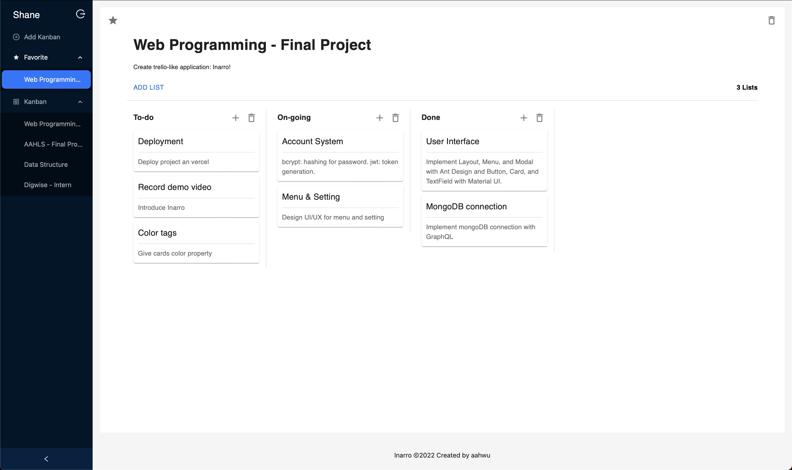

# Inarro 
> Inarro is a project management web application for Web Programming (111-1) final project

##### Project structure (major files)
    .
    ├── components                    # all components and hooks used in the project
    ├── graphql                       # client side gql files                    
    ├── lib                           # mongoDB connection function
    │    └── dbConnect.js                   
    ├── models                        # mongoDB schema
    ├── pages                         # Pages in app
    │    ├── api                   
    │    │    └── graphql.js          # create GraphQL api   
    │    ├── auth                     # login & register pages
    │    └── kanban                   # main kanban pages          
    ├── resolvers                     # resolvers of GraphQL
    ├── .env.local.example            # env example
    ├── package.json            
    ├── yarn.lock
    └── README.md

## Install steps

First, create and modify a **.env.local** file at root (next to pages).  

**.env.local.example** is an example of **.env.local**:

```bash
MONGODB_URI = YOUR_MONGODB_LINK (e.g., mongodb+srv://<username>:<password>@cluster0.hpnvva4.mongodb.net/?retryWrites=true&w=majority)

DEV_URL = "http://localhost:3000"

PROD_URL = ""
```

Second, run the development server at root:

```bash
yarn dev
```

Then you should be able to open this app at http://localhost:3000.

## Service

### Introduction
**Inarro** is a productivity tool mainly for project management.  
It contains three main components: **Kanban**, **List**, **Card**.
1. **Kanban**
Each kanabn may represent a project (e.g., Web Programming - Final Project).
2. **List**
Users can create several lists, which may represent process of the project (e.g., To-do, On-going, Done).  
3. **Card**
Users can create many cards for every subtasks (e.g., frontend, backend, deployment).
4. **react-beautiful-dnd**
Lists and cards are implement with react-beautiful-dnd.
Users can drag and drop every card between lists to manage their project.

This app also reservers much flexibility to accomplish other type of application defined by users.

### Preview


### Other features
1. Account system with **bcrypt** and **jsonwebtoken**. 
2. Add users' favorite kanban.  
3. To be continue ...

## Deploy link
https://inarro.vercel.app

## Demo link


## Review

#### Package & skill:
- Frontend
  - Next.js
  - React
  - Ant Design, Material UI
  - react-beautiful-dnd
- Backend 
  - GraphQL
  - bcrypt
  - jsonwebtoken
- Database
  - MongoDB, mongoose
- Deployment
  - Vercel

#### Thoughts
I think the meme listed below perfectly describes the project and what I learn in this course.
Good news is I'm be able to fly; Bad news is I don't know why I'm be able to fly.  

What I learn in this course makes me be able to build this small but interesting project.
During this project, however, I encounter numberless problems.
For most of these problems, I don't know why they happened, where do they come from, and how should I solve them.
Therefore, I may spend half the time visiting stack overflow and ChatGPT.

Nevertheless, I'm still glad I have taken this course.
This course provides less but enough knowledge for us to explore more skills in web service.
After completion of this course, we are able to build many kinds of applications. 
For me, this project is one of the most interesting work I have done in NTU.


  


